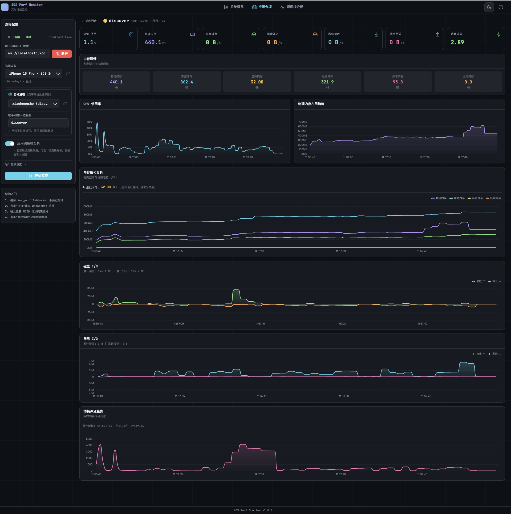
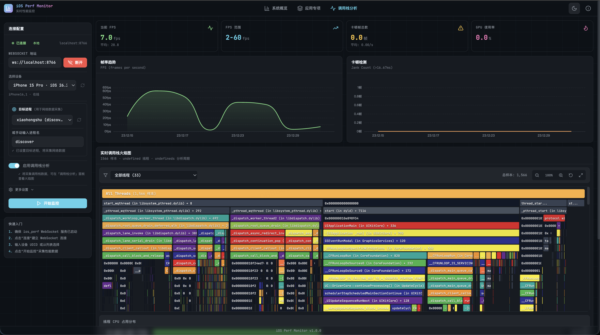

# iOS Perf Monitor

一个现代化的 iOS 设备性能监控前端应用，消费 `ios_perf` WebSocket 服务提供的实时性能数据。





## 功能特性

### 📊 模式 1: 系统概览

- 系统级 CPU、内存使用率实时监控
- GPU 使用率和显存占用
- FPS 帧率和卡顿帧检测
- 多指标对比线状图

### 🔬 模式 2: 细致分析

- FPS 趋势分析和统计
- 卡顿检测（Jank Count）
- **实时调用栈火焰图**（需启用 Stackshot）
- GPU 详细使用率

### 📱 模式 3: 应用专项

- 各进程 CPU 使用分布（堆叠面积图）
- 各进程内存占用分布（堆叠面积图）
- 各进程能耗评分分布（堆叠面积图）
- 进程排行榜（可按 CPU/内存/能耗排序）

## 技术栈

- **React 18** + **TypeScript** - 类型安全的组件化开发
- **Vite** - 快速开发和构建
- **Zustand** - 轻量级状态管理
- **ECharts** - 强大的图表可视化
- **Tailwind CSS** - 现代化 UI 样式
- **Lucide Icons** - 精美图标库

## 快速开始

### 前置条件

1. 解压 `ios_perf.zip`，其中包含两个独立可执行程序：
   - **`ios-perf-monitor`** — 负责 iOS 设备连接与隧道管理
   - **`ios-perf-service`** — 负责性能数据采集并通过 WebSocket 推送

2. 分别在两个终端中启动：

```bash
# 终端 1：启动设备连接监控服务
./ios-perf-monitor
```

```bash
# 终端 2：启动性能采集服务
./ios-perf-service
```

3. 确认设备已就绪：

   `ios-perf-monitor` 启动后会在 `config/` 目录下生成 `device_tunnels` 文件，该文件记录已连接设备的信息及激活状态。当文件中目标设备的状态为**激活（active）**时，Web 端即可通过"开始监控"触发性能采集，实时消费 `ios-perf-service` 推送的性能数据。

`ios-perf-service` 默认监听 `ws://localhost:8766`

### 安装依赖

```bash
cd perf-monitor
npm install
```

### 启动开发服务器

```bash
npm run dev
```

访问 http://localhost:3000

### 构建生产版本

```bash
npm run build
npm run preview
```

## 使用说明

### 连接 WebSocket 服务

1. 在左侧"连接配置"面板输入 WebSocket 地址
   - 本地服务: `ws://localhost:8766`
   - 远端服务: `ws://<远端IP>:8766` (如 `ws://192.168.1.100:8766`)
2. 使用快捷预设按钮快速选择常用地址
3. 历史记录会自动保存，点击时钟图标可查看
4. 点击"连接"按钮建立连接
5. 连接成功后状态栏会显示"本地"或"远端"标识

### 远端连接说明

支持连接运行在其他机器上的 `ios_perf` WebSocket 服务，适用于：

- 在测试服务器上运行采集服务，本地查看数据
- 团队共享同一个采集服务
- 将 iOS 设备连接到远程 Mac，本地查看性能数据

确保：

1. 远端机器上已启动 `ios-perf-monitor` 和 `ios-perf-service`，且 `ios-perf-service` 监听所有网络接口（`0.0.0.0:8766`）
2. 防火墙允许 8766 端口访问
3. 客户端和服务端在同一网络或有网络可达性

### 开始监控

1. 输入或选择目标设备 UDID
2. （可选）输入目标进程名进行过滤
3. （可选）启用"实时调用栈"以获取火焰图数据
4. 点击"开始监控"

### 查看数据

- **系统概览**: 查看系统级性能指标
- **细致分析**: 查看 FPS 详情和火焰图
- **应用专项**: 查看各进程资源分布

## 项目结构

```
perf-monitor/
├── src/
│   ├── components/
│   │   ├── charts/          # 图表组件
│   │   │   ├── LineChart.tsx
│   │   │   ├── MultiLineChart.tsx
│   │   │   ├── StackedAreaChart.tsx
│   │   │   └── FlameGraph.tsx
│   │   ├── panels/          # 面板组件
│   │   │   ├── ConnectionPanel.tsx
│   │   │   ├── OverviewPanel.tsx
│   │   │   ├── DetailedPanel.tsx
│   │   │   └── ProcessPanel.tsx
│   │   └── ui/              # 基础 UI 组件
│   ├── hooks/
│   │   └── useWebSocket.ts  # WebSocket Hook
│   ├── services/
│   │   └── websocket.ts     # WebSocket 服务
│   ├── stores/
│   │   └── perfStore.ts     # Zustand 状态管理
│   ├── types/
│   │   └── index.ts         # TypeScript 类型定义
│   ├── App.tsx
│   ├── main.tsx
│   └── index.css
├── package.json
├── vite.config.ts
├── tailwind.config.js
└── tsconfig.json
```

## 配置说明

### 自定义 WebSocket 地址

在连接配置面板中输入自定义地址，或修改 `src/stores/perfStore.ts` 中的默认值：

```typescript
wsUrl: 'ws://your-server:8766',
```

### 数据保留点数

默认保留最近 300 个数据点（约 30 秒 @10Hz）。可在 `src/stores/perfStore.ts` 中修改：

```typescript
const MAX_DATA_POINTS = 300;
```

## 开发

### 添加新图表

1. 在 `src/components/charts/` 创建新组件
2. 导出到 `index.ts`
3. 在面板组件中使用

### 添加新协议支持

1. 在 `src/types/index.ts` 添加类型定义
2. 在 `src/services/websocket.ts` 添加类型守卫
3. 在 `src/hooks/useWebSocket.ts` 处理新消息类型
4. 在 `src/stores/perfStore.ts` 添加状态和更新方法

## License

MIT
